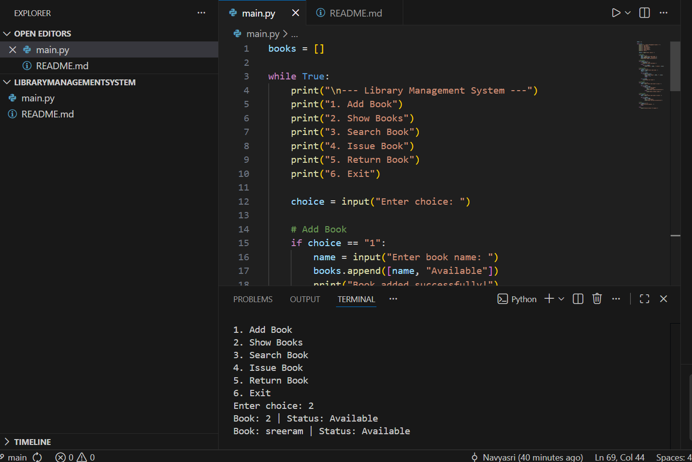

# 📚 Library Management System

A simple Python console-based project to manage library books.

---

## 🚀 Features
- Add Book
- Show Books
- Search Book
- Issue Book
- Return Book
- Menu-driven system

---

## 🛠️ Technologies Used
- Python
- VS Code
- Git & GitHub

---

## ▶️ How to Run

```bash
python main.py
## 📸 Project Screenshot


 

